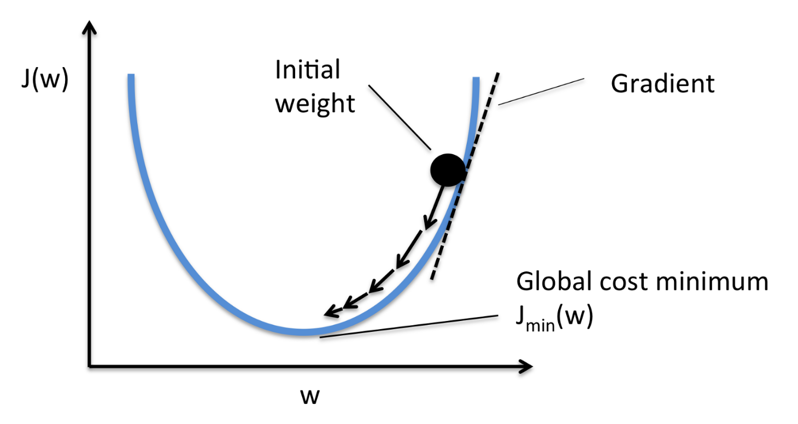

 

#### General

##### Definition
- learn a target function f that maps input  
variables X to output variable Y, with an error e:  
$𝑌 = f(𝑋) + 𝑒$

##### Parameters ~= Coeficient ~= Weight
- $\theta$
- they determine $f$

##### Goal
- find the best parameters making the $f$ works best  
<=> make the cost/loss small

##### Cost Function = Loss Function
- $J$, $J(\theta)$
- eg. $MSE=1/m \cdot \sum_{i=1}^m(\hat{y_i}-y_i)$  
<=> $MSE=1/m \cdot \sum_{i=1}^m(𝑓(x_i)-y_i)$  
$m$: the number of samples 

##### Bias-Variance trade-off
Bias: 偏见，预测结果与实际结果的不同  
Variance: 方差，预测结果本身的波动（受自变量影响）

 

#### Optimization

##### Gradient Descent - 梯度下降

- Aim: minimize the cost function, eg. MSE  

- Methodology:
    - 梯度的方向是函数增长速度最快的方向，那么**梯度的反方向就是函数减少最快的方向**。那么，如果想**计算一个函数的最小值**，就可以使用梯度下降法的思想来做。
    - 假设希望求解目标函数的最小值： $f({x})=f(x_{1},\cdots,x_{n})$  
        可以从一个初始点 ${x}^{(0)}=(x_{1}^{(0)},\cdots,x_{n}^{(0)})$ 开始，基于学习率 $\eta$ 构建一个迭代过程：  

        $x_{1}^{(i+1)} = x_{1}^{(i)} - \eta\cdot \frac{\partial f}{\partial x_{1}}({x}^{(i)})$,  
        $\cdots$  
        $x_{n}^{(i+1)} = x_{n}^{(i)} - \eta\cdot \frac{\partial f}{\partial x_{n}}({x}^{(i)})$  
        
    - 其中 ${x}^{(i)} = (x_{1}^{(i)},\cdots,x_{n}^{(i)})$ ，一旦达到收敛条件，迭代就结束。

    

- Batch Gradient Descent - 批量梯度下降
    - use samples/batch for every iteration
- Stochastic Gradient Descent - SGD - 随机梯度下降
    - use random samples/batch for every iteration
- **Algorithmn porcess of SGD**:  
    - Required: learning rate $\eta$, initialized parameters $\theta$
    - Repeat
        1. **select random m samples/batch from training set**:  
        samples with features ${x^{(1)},\cdots,x^{(m)}}$ and lables ${y^{(1)}, \cdots, y^{(m)}}$  
        2. **calculate gradient**:  
        $g = \nabla_{\theta} \sum_{i=1}^m L(f(x^{(i)};\theta), y^{(i)})/m $  
        3. **parameters update**:  
        $\theta = \theta - \eta \cdot g$  
    - Until converge condition achieved

##### Ordinary Least Squares - 最小二乘法

- Linear Model: 
    - $h_{\theta}(x_1,x_2,...x_n)=\theta_0+\theta_1x_1+...+\theta_nx_n$  
    - Matrix presentation: $h_{\theta}(x) = X\theta$
- Goal: OLS is used to find the estimator/parameters $\theta$
- Method: 
    - minimizes the sum of squared residuals (Cost MSE)
    - 最小二乘法的代数法解法就是**用损失函数对 $\theta_i$ 求偏导数，令偏导数为0，再解方程组**，得到 $\theta_i$ 。

- Steps:
    - **Cost MSE**: 
    $J(\theta) = 1/2 \cdot(X\theta-Y)^T(X\theta-Y)$
    - **用这个损失函数对向量 $\theta$ 求导取0**:
    $\frac{\partial }{\partial \theta}J(\theta)=X^T(X\theta-Y)=0$  
    矩阵求导原理？
    - **Result**:
    $\theta=(X^TX)^{-1}X^TY$

- Details：
    - 其中， 假设函数 $h_{\theta}(x)$ 为 $m\cdot1$ 的向量， $X$ 为 $m \cdot n$ 的向量， $\theta$ 为 $n\cdot1$ 的向量，里面有 $n$ 个代数法的模型参数。 $m$ 代表样本的个数， $n$ 代表样本的特征数。

##### Maximum Likelihood Estimation

PS: review linear algebra
一阶导
二阶导求法
正定矩阵
半正定矩阵
hassion矩阵

 

#### Linear Algorithms

- specify linear/nonlinear
    - 方法一：判别**决策边界是否是直线**。线模型可以是用曲线拟合样本，但是分类的决策边界一定是直线的，例如逻辑回归；
    - 方法二：区分是否为线性模型，主要是看一个乘法式子中自变量 $x$ 前的系数 $w$ ，**应该是说 $x_i$ 只被一个 $w_i$ 影响，那么此模型为线性模型**，或者判断决策边界是线性的；
    - 举例： 
        -  $y=1/[1+exp(w_0+w_1x_1+w_2x_2)]$ ， 画出 $y$ 和 $x$ 是曲线关系，但是它是线性模型，因为 $w_1x_1$ 中可以观察到 $x_1$ 只被一个 $w_1$ 影响；
        -  $y=1/[1+w_5 \cdot exp(w_0+w_1x_1+w_2x_2)]$ ， 此模型是非线性模型，观察到 $x_1$ 不仅仅被参数 $w_1$ 影响，还被 $w_5$ 影响，如果自变量x被两个以上的参数影响，那么此模型是非线性的；

##### Linear Regression
##### Logistic Regression
##### Linear Discriminant Analysis

 

#### Nonlinear Algorithms
##### Classification and Regression Trees
##### Naive Bayes Classifier
##### K-Nearest Neighbors
##### Support Vector Machines

 

#### Ensemble Algorithms
##### Bagging and Random Forest
##### Boosting and AdaBoost

