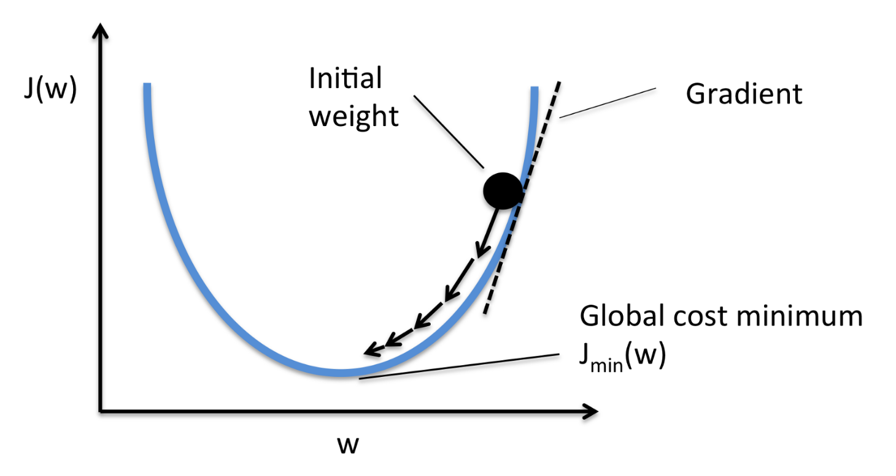

#### General

##### Definition
- learn a target function f that maps input  
variables X to output variable Y, with an error e:  
𝑌 = 𝑓(𝑋) + 𝑒

##### Parameters ~= Coeficient ~= Weight
- they determine 𝑓

##### Aim
- find the best parameters making the f works best  
<=> make the cost/loss small

##### cost function = loss function
- eg. $MSE=1/m \cdot \sum_{i=1}^m(\hat{y_i}-y_i)$  
<=> $MSE=1/m \cdot \sum_{i=1}^m(𝑓(x_i)-y_i)$  
m: the number of samples 

##### Bias-Variance trade-off
Bias: 偏见，预测结果与实际结果的不同  
Variance: 方差，预测结果本身的波动（受自变量影响）

 

#### Optimization

##### Gradient Descent - 梯度下降

- Batch Gradient Descend
- Stochastic Gradient Descent - SGD - 随机梯度下降

##### Ordinary Least Squares

##### Maximum Likelihood Estimation

#### Linear Algorithms
##### Linear Regression
##### Logistic Regression
##### Linear Discriminant Analysis

#### Nonlinear Algorithms
##### Classification and Regression Trees
##### Naive Bayes Classifier
##### K-Nearest Neighbors
##### Support Vector Machines

#### Ensemble Algorithms
##### Bagging and Random Forest
##### Boosting and AdaBoost

