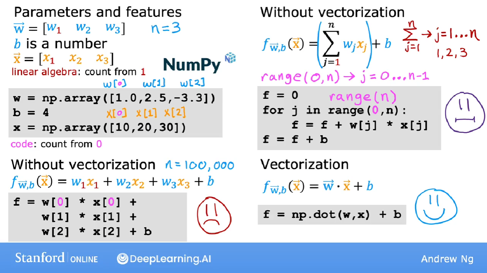
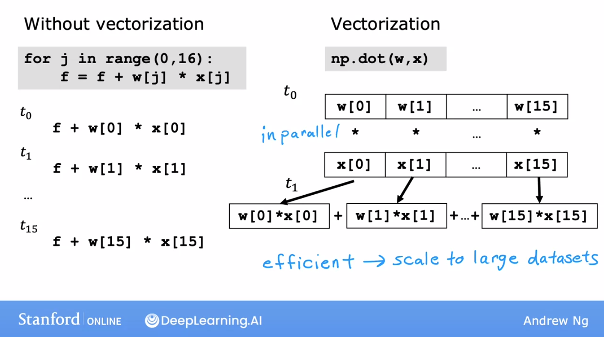
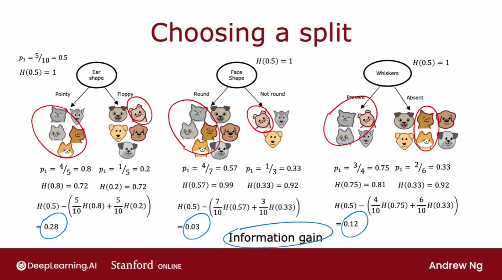
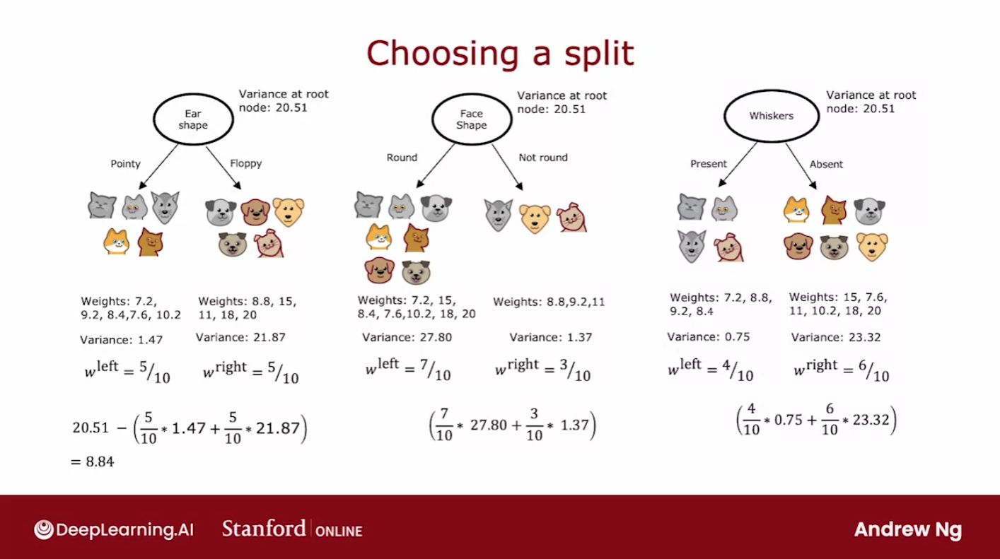
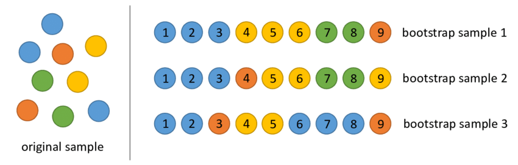

<br>


### General

#### Definition
- learn a target function f that maps input  
variables X to output variable Y, with an error e:  
$𝑌 = f(𝑋) + 𝑒$

#### Parameters ~= Coeficient ~= Weight
- $\theta$
- they determine $f$

#### Goal
- find the best parameters making the $f$ works best  
<=> make the cost/loss small

#### Cost Function = Loss Function
- $J$, $J(\theta)$
- eg. $MSE=1/m \cdot \sum_{i=1}^m(\hat{y_i}-y_i)$  
<=> $MSE=1/m \cdot \sum_{i=1}^m(𝑓(x_i)-y_i)$  
$m$: the number of samples 

#### Bias-Variance trade-off
Bias: 偏见，预测结果与实际结果的不同  
Variance: 方差，预测结果本身的波动（受自变量影响）


<br>


### Optimization

#### Gradient Descent - 梯度下降

- Aim: minimize the cost function, eg. MSE  

- Methodology:
    - 梯度的方向是函数增长速度最快的方向，那么**梯度的反方向就是函数减少最快的方向**。那么，如果想**计算一个函数的最小值**，就可以使用梯度下降法的思想来做。
    - 假设希望求解目标函数的最小值： $f({x})=f(x_{1},\cdots,x_{n})$  
        可以从一个初始点 ${x}^{(0)}=(x_{1}^{(0)},\cdots,x_{n}^{(0)})$ 开始，基于学习率 $\eta$ 构建一个**迭代过程**：  
        $x_{1}^{(i+1)} = x_{1}^{(i)} - \eta\cdot \frac{\partial f}{\partial x_{1}}({x}^{(i)})$,  
        $\cdots$  
        $x_{n}^{(i+1)} = x_{n}^{(i)} - \eta\cdot \frac{\partial f}{\partial x_{n}}({x}^{(i)})$  
    
    - 其中 ${x}^{(i)} = (x_{1}^{(i)},\cdots,x_{n}^{(i)})$ ，一旦达到收敛条件，迭代就结束。
    

- Batch Gradient Descent - 批量梯度下降
    - use samples/batch for every iteration
- Stochastic Gradient Descent - SGD - 随机梯度下降
    - use random samples/batch for every iteration
- **Algorithmn porcess of SGD**:  
    - Required: learning rate $\eta$, initialized parameters $\theta$
    - Repeat
        1. **select random m samples/batch from training set**:  
        samples with features ${x^{(1)},\cdots,x^{(m)}}$ and lables ${y^{(1)}, \cdots, y^{(m)}}$  
        2. **calculate gradient**:  
        $g = \nabla_{\theta} \sum_{i=1}^m L(f(x^{(i)};\theta), y^{(i)})/m $  
        3. **parameters update**:  
        $\theta = \theta - \eta \cdot g$  
    - Until converge condition achieved
- 牛顿法比普通梯度下降更快的原因？
    - 梯度下降的一阶泰勒展开式：https://blog.csdn.net/red_stone1/article/details/80212814
    - 牛顿法的二阶泰勒展开式：


#### Ordinary Least Squares - 最小二乘法

- Linear Model: 
    - $h_{\theta}(x_1,x_2,...x_n)=\theta_0+\theta_1x_1+...+\theta_nx_n$  
    - Matrix representation: $h_{\theta}(x) = X\theta$
- Goal: OLS is used to find the estimator/parameters $\theta$
- Method: 
    - minimizes the sum of squared residuals (Cost MSE)
    - 最小二乘法的代数法解法就是**用损失函数对 $\theta_i$ 求偏导数，令偏导数为0，再解方程组**，得到 $\theta_i$ 。

- Steps:
    - **Cost MSE**: 
    $J(\theta) = 1/2 \cdot(X\theta-Y)^T(X\theta-Y)$
    - **用这个损失函数对向量 $\theta$ 求导取0**:
    $\frac{\partial }{\partial \theta}J(\theta)=X^T(X\theta-Y)=0$  
    矩阵求导原理？
    - **Result**:
    $\theta=(X^TX)^{-1}X^TY$

- Details：
    - 其中，假设函数 $h_{\theta}(x)$ 为 $m\cdot1$ 的向量， $X$ 为 $m \cdot n$ 的向量， $\theta$ 为 $n\cdot1$ 的向量，里面有 $n$ 个代数法的模型参数。 $m$ 代表样本的个数， $n$ 代表样本的特征数。


#### Maximum Likelihood Estimation - 极大似然估计法

PS: review linear algebra
一阶导
二阶导求法
正定矩阵
半正定矩阵
hassion矩阵


<br>


### Linear Algorithms

Recognize linear/nonlinear:
- 方法一：判别**决策边界是否是直线**。线模型可以是用曲线拟合样本，但是分类的决策边界一定是直线的，例如逻辑回归；
- 方法二：区分是否为线性模型，主要是看一个乘法式子中自变量 $x$ 前的系数 $w$ ，**应该是说 $x_i$ 只被一个 $w_i$ 影响，那么此模型为线性模型**，或者判断决策边界是线性的；
- 举例： 
- $y=1/[1+exp(w_0+w_1x_1+w_2x_2)]$ ，画出 $y$ 和 $x$ 是曲线关系，但是它是线性模型，因为 $w_1x_1$ 中可以观察到 $x_1$ 只被一个 $w_1$ 影响；
- $y=1/[1+w_5 \cdot exp(w_0+w_1x_1+w_2x_2)]$ ，此模型是非线性模型，观察到 $x_1$ 不仅仅被参数 $w_1$ 影响，还被 $w_5$ 影响，如果自变量 $x$ 被两个以上的参数影响，那么此模型是非线性的；

#### Linear Regression

- Vectorization :
    - Representation
    
    - Advantages
        - code shorter
        - algerbra libraries, GPU computing
        - calculate faster 
            - can be run seperately (parallel computing with parallel hardwares, boht in CPU and GPU) 
            - instead of running loop
        
        


- Single 
- Multiple
- Polynomial - 多项式回归

- Logistics - 逻辑回归

#### Logistic Regression
#### Linear Discriminant Analysis


<br>


### Nonlinear Algorithms

#### Classification and Regression Trees

- Decision Tree - 决策树 - for classification
    - Steps for building a decision tree:
        1. Start with all examples at the root node
        2. Calculate **information gain** for splitting **on all possible features**, and **pick the one** with the highest information gain
        3. **Split** dataset according to the selected feature, and create left and right branches of the tree
        4. Keep **repeating** splitting process until **stopping criteria** is met
    - Information Gain
        - the reduction in entropy that you get in your tree resulting from making a split
    - Entropy
        - shows the **randomness of the sample set**
        - Compute $p_1$, which is the fraction of examples that are edible (i.e. have value = `1` in `y`)
        - Entropy: $H(p_1) = -p_1 {log}_2(p_1) - (1- p_1) {log}_2(1- p_1)$
        - To expand: $H(p_1, p_2, ...p_n) = -p_1 {log}_2(p_1) -p_2 {log}_2(p_2) -...-p_n {log}_2(p_n)$
        - 0 perfect purity, 1 worst purity
    - Gini to replace Entropy
        - shows the **randomness of the sample set**
        - $Gini = \sum_{k=1}^n [p_k \cdot(1-p_k)]$
        - 0 perfect purity, 0.5 worst purity
    - Continuous Features
        - eg. 10 values in the feature, then try 9 split values to split tree
    

- Decision Tree - 决策树 - for regression
    - Steps diff to classification tree:
        - **replace Entropy with Variance** to evaluate the Impure/Discrete
        - or can **replace Entropy with cost/MSE** 
    

- Advantages:
    - Easy to interpret and no overfitting with pruning
    - Works for both regression and classification problems
    - Can take any type of variables without modifications, and do not require any data preparation

- Disadvantages:
    - sensitive to sample changes

#### Naive Bayes Classifier
#### K-Nearest Neighbors
#### Support Vector Machines


<br>


### Ensemble Algorithms - 集成算法


#### Bagging and Random Forest
- Bagging
    - Deal with DT's sensitivity to sample changes
    - Bagging can reduce the variance of high-variance models
    - estimate a quantity from a sample by creating many random subsamples with replacement, and **computing the mean of each subsample model**.
- sampling with replacement - 有放回地取样
    - eg. 需取样10个，每次取一个后放回去，取十次，作为一个子样本集
    
- Random Forest Steps
    1. given training set of size m
    2. for b = 1 to B:
        - sampling with replacement to create new training set with size m
        - given n features, choose $\sqrt{n}$ (for classification) or $n/3$ (for regression) to split decision tree
        - train decision tree on new data set
    3. bagged decision trees
- Feature selection
    - Bagged method can provide feature importance, by calculating and averaging the error function drop for individual variables
- Advantage:
    - Robust to overfitting and missing variables
    - Can be parallelized for distributed computing

#### Boosting and AdaBoost

#### GBDT and XGBoost


PCA & LDA
降维


### 特征工程
#### 特征构建
#### 预处理


### Feature Selection - 特征选择
https://zhuanlan.zhihu.com/p/507101225

#### Filter - 过滤法
- Multicollinearity - 删除具有多重共线性的特征 & Correlation - 删除不相关的特征
    - 数值变量：
        - Heatmap 查看各个特征之间/特征与目标变量的相关性
        - 设置阈值删除某些共线特征（eg. 0.8）
        - 设置阈值删除与目标变量不相关的特征
    - 类别变量：
        - 特征之间
            - 卡方检验（检验两个特征是否相关）
            - 0假设：两特征不相关/两特征互相独立
            - p小，拒绝原假设，特征相关
            - 两特征列联表汇总，查看卡方值和p值
            - p 值 <0.05，因此我们可以拒绝特征之间没有关联的原假设，即两个特征之间存在统计上显着的关系。
            - 由于这两个特征之间存在关联，我们可以选择删除其中一个。
        - 目标变量与特征之间，同理，但删除不相关的特征
    - 多重共线独有：
        - VIF - 方差膨胀因子：整体模型方差与每个独立特征的方差的比率
            ```
            # calculate VIF 
            vif = pd.Series([variance_inflation_factor(X.values, i) for i in range(X.shape[1])], index=X.columns) 
            ```
        - VIF = 1 表示无相关性，VIF = 1-5 中等相关性，VIF >5 高相关
        - 删除高VIF的特征
- coefficient - 特征系数
    - 系数是否显著
        - 计算各个特征对目标值的系数以及系数的p值
        - 0假设：该系数无关；正式假设：该系数有关
        - p < 0.05，拒绝0假设，使用该特征
    - 特征贡献是否足够大
        - 如果正在运行回归任务，则特征适应度的一个关键指标是回归系数（所谓的 beta 系数），它显示了模型中特征的相对贡献。 有了这些信息，可以删除贡献很小或没有贡献的功能。


#### Wrapper - 包装法

#### Embedded - 嵌入法

#### Dimension Reduction - 降维


coefficient 系数 - 例如线性模型
Correlation 相关性