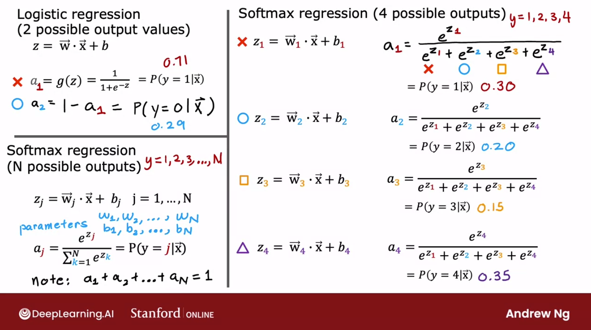
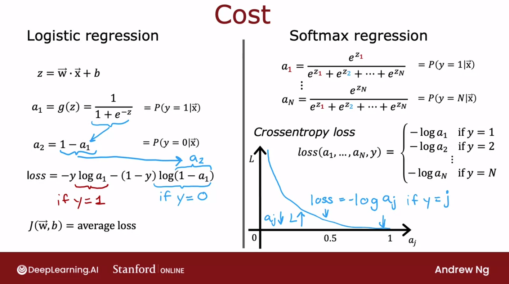
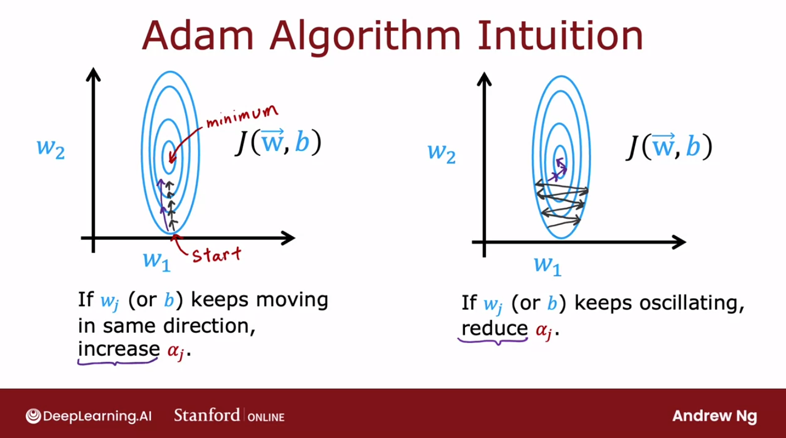
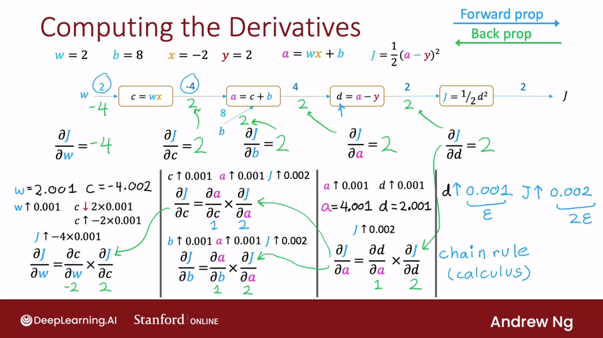
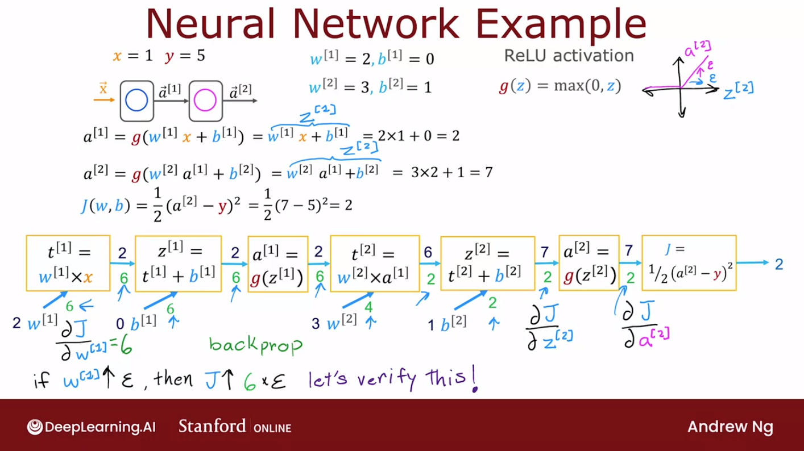
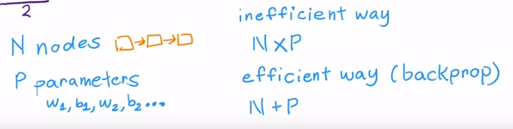
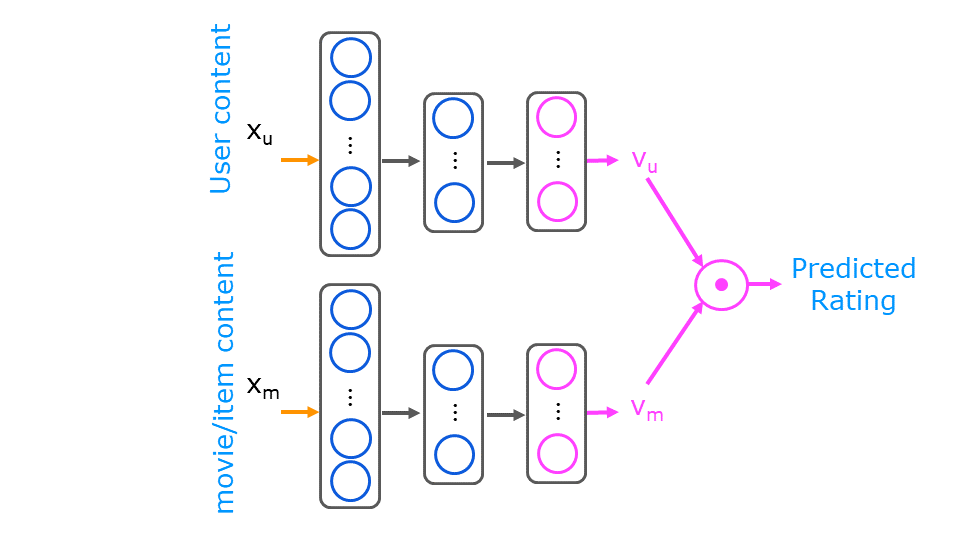

<br>


### General

#### Definition
- learn a target function f that maps input  
variables X to output variable Y, with an error e:  
$𝑌 = f(𝑋) + 𝑒$

#### Parameters ~= Coeficient ~= Weight
- $\theta$
- they determine $f$

#### Goal
- find the best parameters making the $f$ works best  
<=> make the cost/loss small

#### Cost Function = Loss Function
- $J$, $J(\theta) = 1/2 \cdot \sum_{i=1}^m(\hat{y_i}-y_i)^2$
- eg. $MSE=1/m \cdot \sum_{i=1}^m(\hat{y_i}-y_i)^2$  
<=> $MSE=1/m \cdot \sum_{i=1}^m(𝑓(x_i)-y_i)^2$  
$m$: the number of samples 

#### Bias-Variance trade-off
Bias: 偏见，预测结果与实际结果的不同  
Variance: 方差，预测结果本身的波动（受自变量影响）


----------------------------------------------------------------
<br>


### Optimization

#### Gradient Descent - 梯度下降

- Aim: minimize the cost function, eg. MSE  

- Methodology:
    - 梯度的方向是函数增长速度最快的方向，那么**梯度的反方向就是函数减少最快的方向**。那么，如果想**计算一个函数的最小值**，就可以使用梯度下降法的思想来做。
    - 假设希望求解目标函数的最小值： $f({x})=f(x_{1},\cdots,x_{n})$  
        可以从一个初始点 ${x}^{(0)}=(x_{1}^{(0)},\cdots,x_{n}^{(0)})$ 开始，基于学习率 $\eta$ 构建一个**迭代过程**：  
        $x_{1}^{(i+1)} = x_{1}^{(i)} - \eta\cdot \frac{\partial f}{\partial x_{1}}({x}^{(i)})$,  
        $\cdots$  
        $x_{n}^{(i+1)} = x_{n}^{(i)} - \eta\cdot \frac{\partial f}{\partial x_{n}}({x}^{(i)})$  
    
    - 其中 ${x}^{(i)} = (x_{1}^{(i)},\cdots,x_{n}^{(i)})$ ，一旦达到收敛条件，迭代就结束。
      

- Batch Gradient Descent - 批量梯度下降
    - use samples/batch for every iteration
- Stochastic Gradient Descent - SGD - 随机梯度下降
    - use random samples/batch for every iteration
- **Algorithmn porcess of SGD**:  
    - Required: learning rate $\eta$, initialized parameters $\theta$
    - Repeat
        1. **select random m samples/batch from training set**:  
        samples with features ${x^{(1)},\cdots,x^{(m)}}$ and lables ${y^{(1)}, \cdots, y^{(m)}}$  
        2. **calculate gradient**:  
        $g = \nabla_{\theta} \sum_{i=1}^m L(f(x^{(i)};\theta), y^{(i)})/m $  
        3. **parameters update**:  
        $\theta = \theta - \eta \cdot g$  
    - Until converge condition achieved
- 牛顿法比普通梯度下降更快的原因？
    - 核心思想，牛顿法用二次函数拟合f，避免梯度下降时下一个点走的太远反而增大了f，反而是让下一个点走到f’’为0的地方
          
    - https://zhuanlan.zhihu.com/p/59873169
    - https://zhuanlan.zhihu.com/p/37524275
    - 梯度下降的一阶泰勒展开式：https://blog.csdn.net/red_stone1/article/details/80212814
    - 牛顿法的二阶泰勒展开式：


#### Ordinary Least Squares - 最小二乘法

- Linear Model: 
    - $h_{\theta}(x_1,x_2,...x_n)=\theta_0+\theta_1x_1+...+\theta_nx_n$  
    - Matrix representation: $h_{\theta}(x) = X\theta$
- Goal: OLS is used to find the estimator/parameters $\theta$
- Method: 
    - minimizes the sum of squared residuals (Cost MSE)
    - 最小二乘法的代数法解法就是**用损失函数对 $\theta_i$ 求偏导数，令偏导数为0，再解方程组**，得到 $\theta_i$ 。

- Steps:
    - **Cost MSE**: 
    $J(\theta) = 1/2 \cdot(X\theta-Y)^T(X\theta-Y)$
    - **用这个损失函数对向量 $\theta$ 求导取0**:
    $\frac{\partial }{\partial \theta}J(\theta)=X^T(X\theta-Y)=0$  
    矩阵求导原理？
    - **Result**:
    $\theta=(X^TX)^{-1}X^TY$

- Details：
    - 其中，假设函数 $h_{\theta}(x)$ 为 $m\cdot1$ 的向量， $X$ 为 $m \cdot n$ 的向量， $\theta$ 为 $n\cdot1$ 的向量，里面有 $n$ 个代数法的模型参数。 $m$ 代表样本的个数， $n$ 代表样本的特征数。


#### Maximum Likelihood Estimation - 极大似然估计法

PS: review linear algebra
一阶导
二阶导求法
正定矩阵
半正定矩阵
hassion矩阵


----------------------------------------------------------------
<br>


### Model Selection & Model Evaluation

- **Model selection**: estimating the performance of different
models (hyperparameters) in order to choose the best  
- **Model evaluation** (assessment): having chosen a final model,
estimating its prediction error (generalization error) on new
data

- Validation Set
  

- Cross-validation
    - Cut the training set in k separate folds
    - For each fold, train on the (k-1) remaining folds
    - In practice: set k=5 or k=10
      


#### Classification Model Evaluation

- Confusion Matrix & Evaluation Metrics 
    <!--    -->
      

    - False positives (false alarms) are also called type I errors
    False negatives (misses) are also called type II errors

    - 在模型预测是正例的所有结果中，模型预测对的比重
    Precision = Positive predictive value (PPV): $PPV=\frac{TP}{TP + FP}$  # of predicted positives
    
    - 在真实值是正例的所有结果中，模型预测对的比重
    Recall = True positive rate (TPR): $TPR=\frac{TP}{TP + FN}$  # of positives

    <!-- - Specificity = True negative rate (TNR): $TNR=\frac{TN}{FP + TN}$
    False discovery rate (FDR): $FDR=\frac{FP}{FP + TP}$ -->

    - 分类模型中所有判断正确的结果占总观测值得比重
    Accuracy: $Acc=\frac{TP + TN}{TP + FN + FP + TN}$

    - 精确率和召回率的调和平均值
    F1-score: $F1=\frac{2TP}{2TP + FP + FN}$

- ROC Curve - Receiver-Operator Characteristic
    - AUC - Area Under Curve
    - ROC-AUC 指的是 ROC 曲线下的面积
     


- Hit Rate
    - 命中率（Hit Rate，HR），它反映的是在推荐序列中是否包含了用户真正点击的item，公式如下，N表示推荐次数，hit()函数表示是否命中，即用户选择的item是否在推荐序列中，存在则为1，反之则为0。
    $$HR = \frac{1}{N} \cdot \sum_{i=1}^N hit(i)$$

- Dice Coefficient
    - 分割过程中的评价标准主要采用Dice相似系数(Dice Similariy Coefficient,DSC),Dice系数是一种集合相似度度量指标,通常用于计算两个样本的相似度,值的范围  ,分割结果最好时值为1,最差时值为0
    $$Dice(P,T) = \frac{\left| P_{1} \wedge T_{1}  \right|}{(\left| P_{1} \right| + \left| T_{2} \right|)/2} \Leftrightarrow Dice = \frac{2TP}{FP+2TP+FN}$$
     


----------------------------------------------------------------
<br>


### Linear Algorithms

Recognize linear/nonlinear:
- 方法一：判别**决策边界是否是直线**。线模型可以是用曲线拟合样本，但是分类的决策边界一定是直线的，例如逻辑回归；
- 方法二：区分是否为线性模型，主要是看一个乘法式子中自变量 $x$ 前的系数 $w$ ，**应该是说 $x_i$ 只被一个 $w_i$ 影响，那么此模型为线性模型**，或者判断决策边界是线性的；
- 举例： 
- $y=1/[1+exp(w_0+w_1x_1+w_2x_2)]$ ，画出 $y$ 和 $x$ 是曲线关系，但是它是线性模型，因为 $w_1x_1$ 中可以观察到 $x_1$ 只被一个 $w_1$ 影响；
- $y=1/[1+w_5 \cdot exp(w_0+w_1x_1+w_2x_2)]$ ，此模型是非线性模型，观察到 $x_1$ 不仅仅被参数 $w_1$ 影响，还被 $w_5$ 影响，如果自变量 $x$ 被两个以上的参数影响，那么此模型是非线性的；

#### Linear Regression

- Vectorization :
    - Representation
            
            
    - Advantages
        - code shorter
        - algerbra libraries, GPU computing
        - calculate faster 
            - can be run seperately (parallel computing with parallel hardwares, boht in CPU and GPU) 
            - instead of running loop
          
          

- Single - 一元回归
- Multiple - 多元回归
- Polynomial - 多项式回归
    - make new features by cross multiplying existing ones

- Lasso/Ridge Regression
    - cost func with regularization term, where $\lambda ≥ 0$ is a tuning parameter	to	be	determined

$$\begin{aligned}
J(\theta) &= 1/2 \cdot \sum_{i=1}^m(\hat{y_i}-y_i)^2\\
lasso\_reg &= \lambda \cdot \sum_{i=1}^m|\beta_i| \\ 
ridge\_reg &= \lambda \cdot \sum_{i=1}^m|\beta_i|^2\\
Cost &= J(\theta) + lasso\_reg | ridge\_reg
\end{aligned}$$


#### Logistic Regression

- for binary classification
- Logistic regression a linear method but predictions are transformed using the **logistic function (or sigmoid)**
 


#### Linear Discriminant Analysis - 线性判别分析
- 原理：给定训练集样例，设法将**样例投影到一条直线**上，使得**同类样例的投影点尽可能的接近、异类样例的投影点尽可能地远离**；在对**新样本分类时，将其投影点同样的投影到这条直线上**，再根据投影点的位置来确定新样例的位置
  

- LDA can be used for **dimensionality reduction** by keeping the latent variables as new variables

- LDA representation consists of statistical properties calculated for each class: means and the covariance matrix:  

$$\begin{aligned}
\mu_k &= \frac{1}{m_k} \sum_{i=1}^{m_k} x_i \\
S_k = \sigma_k^2 &= \frac{1}{m_k} \sum_{i=1}^{m_k} (x_i-\mu_k)^2
\end{aligned}$$

- Distribution diff inside classes in projected space:
    $$S_w = \sum_{k=1}^K S_k$$

- Distribution diff between classes (means diff, eg with 2 classes):
<div align=center></div> 

- Algorithms Steps 
 

- 与PCA的区别
    - PCA主要是从特征的协方差角度，去找到比较好的投影方式，即选择样本点投影具有最大方差的方向；
    - LDA则更多的是考虑了分类标签信息，寻求投影后不同类别之间数据点距离更大化以及同一类别数据点距离最小化，即**选择分类性能最好的方向**。
    - PCA需要与其他算法结合使用
    - LDA是一种监督式学习方法，除了可以降维外，还可以进行预测应用


----------------------------------------------------------------
<br>


### Nonlinear Algorithms

#### Classification and Regression Trees

- Decision Tree - 决策树 - for classification
    - Steps for building a decision tree:
        1. Start with all examples at the root node
        2. Calculate **information gain** for splitting **on all possible features**, and **pick the one** with the highest information gain
        3. **Split** dataset according to the selected feature, and create left and right branches of the tree
        4. Keep **repeating** splitting process until **stopping criteria** is met
    - Information Gain
        - the reduction in entropy that you get in your tree resulting from making a split
    - Entropy
        - shows the **randomness of the sample set**
        - Compute $p_1$, which is the fraction of examples that are edible (i.e. have value = `1` in `y`)
        - Entropy: $H(p_1) = -p_1 {log}_2(p_1) - (1- p_1) {log}_2(1- p_1)$
        - To expand: $H(p_1, p_2, ...p_n) = -p_1 {log}_2(p_1) -p_2 {log}_2(p_2) -...-p_n {log}_2(p_n)$
        - 0 perfect purity, 1 worst purity
    - Gini to replace Entropy
        - shows the **randomness of the sample set**
        - $Gini = \sum_{k=1}^n [p_k \cdot(1-p_k)]$
        - 0 perfect purity, 0.5 worst purity
    - Continuous Features
        - eg. 10 values in the feature, then try 9 split values to split tree
      

- Decision Tree - 决策树 - for regression
    - Steps diff to classification tree:
        - **replace Entropy with Variance** to evaluate the Impure/Discrete
        - or can **replace Entropy with cost/MSE** 
      

- Advantages:
    - Easy to interpret and no overfitting with pruning
    - Works for both regression and classification problems
    - Can take any type of variables without modifications, and do not require any data preparation

- Disadvantages:
    - sensitive to sample changes

#### Naive Bayes Classifier
#### K-Nearest Neighbors
#### Support Vector Machines


----------------------------------------------------------------
<br>


### Ensemble Algorithms - 集成学习

- Bagging: 
    - 是Bootstrap aggregating的意思，各分类器之间无强依赖，可以并行。
    - reduce variance 方差
- Boosting: 
    - 串行的方式训练基分类器，各分类器之间有依赖。
    - reduce bias 偏差
- Stacking
    - 先用全部数据训练好基模型，然后每个基模型都对每个训练样本进行的预测
    - 其**预测值将作为训练样本的特征值**，最终会得到新的训练样本
    - 然后基于新的训练样本进行训练得到模型，然后得到最终预测结果

#### Bagging & Random Forest - Bagging & 随机森林
- Bagging
    - Deal with DT's sensitivity to sample changes
    - Bagging can reduce the variance of high-variance models
    - estimate a quantity from a sample by creating many random subsamples with replacement, and **computing the mean of each subsample model**.
- sampling with replacement - 有放回地取样
    - eg. 需取样10个，每次取一个后放回去，取十次，作为一个子样本集
      
- Random Forest Steps
    1. given training set of size m
    2. for b = 1 to B:
        - sampling with replacement to create new training set with size m
        - given n features, choose $\sqrt{n}$ (for classification) or $n/3$ (for regression) to split decision tree
        - train decision tree on new data set
    3. bagged decision trees
- Feature selection
    - Bagged method can provide feature importance, by calculating and averaging the error function drop for individual variables
- Advantage:
    - Robust to overfitting and missing variables
    - Can be parallelized for distributed computing

#### Boosting and AdaBoost

- AdaBoost - Adaptive Boosting
    - 思想：
        - 对分类正确的样本降低权重
        - 对错误分类的样本升高或者保持权重不变
        - 在模型融合过程中，根据错误率对基分类器器进行加权融合，错误率低的分类器拥有更大的“话语权”

#### GBDT and XGBoost
https://zhuanlan.zhihu.com/p/86263786

- GBDT - Gradient Boosting Decision Tree

    - 原理 - GBDT 由三个概念组成
        - **Regression Decision Tree** - DT
            - **模型包含多棵树，将所有预测结果想加，得到最终结果**
            - 模型的每一轮预测都和真实值有gap，这个gap称为残差
            - **下一轮的树对残差进行预测**
            - $F_k(x) = \sum_{i=1}^{k}f_{i}(x)$
            - $F_k(x) = F_{k-1}(x)+f_{k}(x)$
        - **Gradient Boosting** - GB
            - 损失函数Loss: $J=\frac{1}{2}(y-F_{k}(x))^2$
            - **残差**其实是**最小均方损失函数Loss关于预测值的反向梯度**：
            $-g = -\frac{\partial (\frac{1}{2}(y-F_{k}(x))^2)}{\partial F_k(x)} = y-F_{k}(x)$
            - 预测值和实际值的残差与损失函数的负梯度相同
            - **每训练一棵树，拟合残差/L的负梯度，让总模型利用这棵树往L下降的方向走，类似于梯度下降**
        - **Shrinkage** 削弱每棵树的影响
            - 每次走一小步的方式逐渐逼近真实结果，这样比每次迈一大步的方式更容易避免过拟合
            - 每棵树加入到前一个模型前增加一个学习率/步长 $\eta$
            - $F_i(x)=F_{i-1}(x)+\mu f_i(x)$
    - GBDT 的每一步残差计算其实变相地**增大了被分错样本的权重**，而对于**分对样本的权重趋于0**，这样后面的树就能专注于那些被分错的样本
    - Gradient被用来让Loss快速下降，进而让模型效果Boost
    - GBDT使用的弱学习器必须是回归树。GBDT用来做回归预测，当然，通过设置阈值也能用于分类任务
    - **Steps**:
          

- XGBoost - Extreme Gradient Boosting Decision Tree
    - XGBoost 是大规模并行 boosting tree 的工具
    - Diff to GBDT
    https://zhuanlan.zhihu.com/p/42740654
        - 传统GBDT以CART作为基分类器，XGBoost还**支持线性分类器**，这个时候XGBoost相当于带L1和L2正则化项的逻辑斯蒂回归（分类问题）或者线性回归（回归问题）。
        - 传统GBDT在优化时只用到一阶导数信息，XGBoost则对代价函数进行了**二阶泰勒展开，同时用到了一阶和二阶导数**。
        - XGBoost在**代价函数里加入了正则项，用于控制模型的复杂度**。正则项里包含了树的叶子节点个数、每个叶子节点上输出的score的L2模的平方和。从Bias-variance tradeoff角度来讲，正则项降低了模型的variance，使学习出来的模型更加简单，防止过拟合，这也是XGBoost优于传统GBDT的一个特性。
        - **Shrinkage**（缩减），相当于学习速率（XGBoost中的eta）。XGBoost在进行完一次迭代后，会将叶子节点的权重乘上该系数，主要是为了削弱每棵树的影响，让后面有更大的学习空间。实际应用中，一般把eta设置得小一点，然后迭代次数设置得大一点。（补充：传统GBDT的实现也有学习速率）
        - **列抽样（column subsampling）**。XGBoost借鉴了**随机森林**的做法，支持列抽样，不仅能降低过拟合，还能减少计算，这也是XGBoost异于传统gbdt的一个特性。
        - 对**缺失值**的处理。对于特征的值有缺失的样本，XGBoost可以自动学习出它的分裂方向。
        - XGBoost工具支持**并行**。boosting不是一种串行的结构吗?怎么并行的？注意XGBoost的并行**不是tree粒度的并行，XGBoost也是一次迭代完才能进行下一次迭代的**。XGBoost的并行是在**特征粒度上**的。我们知道，决策树的学习最耗时的一个步骤就是对特征的值进行排序（因为要确定最佳分割点），**XGBoost在训练之前，预先对数据进行了排序，然后保存为block结构，后面的迭代中重复地使用这个结构**，大大减小计算量。**这个block结构也使得并行成为了可能**，在进行节点的分裂时，需要计算每个特征的增益，最终选增益最大的那个特征去做分裂，那么各个特征的增益计算就可以开多线程进行。


----------------------------------------------------------------
<br>


### Nueral Network - 神经网络

#### Basic Nueral Network

- Notation 
    - layer 0 input with n nodes
    - layer 1 with $w^{[1]}_{1,2,3,...}$ -> n1 nodes
    - layer 2 with $w^{[2]}_{1,2,3,...}$ -> n2 nodes
       

- Activation Funcs
    - why use activation?
        - manay layers come to be one layer -> NN same as linear model
    - why sigmoid not enough?
        - It assumes that awareness is maybe binary - either people are aware or they are not
        - Maybe awareness should be any non negative number
        - ReLU instead
          
    - Choosing which to use
        - target/ouput layer
            - sigmoid good for binary
            - original linear for regression
            - ReLU for none neg prediction
        - hidden layer - ReLU common
            - compute faster
            - learning faster because no flat result in the sigmoid (close to -1/1 when activated values are extreme)

- Multi class & Softmax

- softmax

$$a_j = \frac{e^{z_j}}{ \sum_{k=0}^{N-1}{e^{z_k} }}$$

$$\begin{aligned}
    \mathbf{a}(x) =
    \begin{bmatrix}
        P(y = 1 | \mathbf{x}; \mathbf{w},b) \\
        \vdots \\
        P(y = N | \mathbf{x}; \mathbf{w},b)
        \end{bmatrix}
        =
        \frac{1}{ \sum_{k=1}^{N}{e^{z_k} }}
        \begin{bmatrix}
        e^{z_1} \\
        \vdots \\
        e^{z_{N}} \\
    \end{bmatrix} 
\end{aligned}$$

<div align=center></div>
    
- softmax cost 

$$\begin{aligned} 
    L(\mathbf{a},y)=\begin{cases} 
        -log(a_1), & \text{if y=1}.\\
            &\vdots\\
        -log(a_N), & \text{if y=N} 
    \end{cases} 
\end{aligned}$$
        
<div align=center></div>  

- Adam Gradient Decent
    - if **a parameter w_j, or b seems to keep on moving in roughly the same direction**. graph_left -> **increase the learning rate for that parameter** & go faster in that direction. 
    - Conversely, if **a parameter keeps oscillating back and forth**. graph_right -> **reduce Alpha_j for that parameter** &  not have it keep on oscillating or bouncing back and forth.  
      

- Back Propagation
    - Notation  
      
      

    - advantage: 每层反向传播都会存储用于下一层，故就算所有输入参数的梯度时，中间梯度不用重复计算（动态规划）
      


#### Converlutional Nueral Network - CNN - 卷积神经网络
   


----------------------------------------------------------------
<br>


### 特征工程
#### 特征构建
#### 预处理


#### Feature Selection - 特征选择
https://zhuanlan.zhihu.com/p/507101225

##### Filter - 过滤法
- Multicollinearity - 删除具有多重共线性的特征 & Correlation - 删除不相关的特征
    - 数值变量：
        - Heatmap 查看各个特征之间/特征与目标变量的相关性
        - 设置阈值删除某些共线特征（eg. 0.8）
        - 设置阈值删除与目标变量不相关的特征
    - 类别变量：
        - 特征之间
            - 卡方检验（检验两个特征是否相关）
            - 0假设：两特征不相关/两特征互相独立
            - p小，拒绝原假设，特征相关
            - 两特征列联表汇总，查看卡方值和p值
            - p 值 <0.05，因此我们可以拒绝特征之间没有关联的原假设，即两个特征之间存在统计上显着的关系。
            - 由于这两个特征之间存在关联，我们可以选择删除其中一个。
        - 目标变量与特征之间，同理，但删除不相关的特征
    - 多重共线独有：
        - VIF - 方差膨胀因子：整体模型方差与每个独立特征的方差的比率
            ```
            # calculate VIF 
            vif = pd.Series([variance_inflation_factor(X.values, i) for i in range(X.shape[1])], index=X.columns) 
            ```
        - VIF = 1 表示无相关性，VIF = 1-5 中等相关性，VIF >5 高相关
        - 删除高VIF的特征
- coefficient - 特征系数
    - 系数是否显著
        - 计算各个特征对目标值的系数以及系数的p值
        - 0假设：该系数无关；正式假设：该系数有关
        - p < 0.05，拒绝0假设，使用该特征
    - 特征贡献是否足够大
        - 如果正在运行回归任务，则特征适应度的一个关键指标是回归系数（所谓的 beta 系数），它显示了模型中特征的相对贡献。 有了这些信息，可以删除贡献很小或没有贡献的功能。

##### Wrapper - 包装法
- 前向选择
    - 从 0 特征开始，然后添加一个最大程度地减少错误的特征；然后添加另一个特征，依此类推。
- 向后选择
    - 模型从包含的所有特征开始并计算误差；然后它消除了一个可以进一步减少误差的特征。 重复该过程，直到保留所需数量的特征。
##### Embedded - 嵌入法
- Random Forest / GBDT / XGBoost 的 feature_importance

##### Dimension Reduction - 降维
PCA & LDA
从应用的角度，**对无监督的任务使用PCA 进行降维，对有监督的则应用LDA**


----------------------------------------------------------------
<br>


### Recommender System - 推荐系统

#### Methodology
- Retrieval - Candidate Generate
    - eg. collaborative Filtering, top 10 items in user's 3 hot catogaries
    - delete duplicates from different retrieval items
- Ranking
    - eg. FM/Content based method

#### Collaborative Filtering - 协同过滤

#### Content Based Filtering - 基于内容的过滤

- Generates a user and item feature vector 
- with user features & item features in Nueral Network
    - The user features & item features is provided to a neural network which then generates the user and movie vector as shown below.
    - two networks that are combined by a dot product
      
- Minimize the following cost
    $$J = \sum_{i,j:r(i,j)=1}(v_u^{j} \cdot v_m^{i} - y^{(i,j)})^2 +\text{regularization}$$
- Find similar items:
    - A similarity measure is the squared distance between the two vectors $v_m^{(k)}$ and $v_m^{(i)}$: $$\left\Vert v_m^{(k)} - v_m^{(i)} \right\Vert^2 = \sum_{l=1}^{n}(v_{m_l}^{(k)} - v_{m_l}^{(i)})^2\tag{1}$$


----------------------------------------------------------------
<br>

coefficient 系数 - 例如线性模型
Correlation 相关性